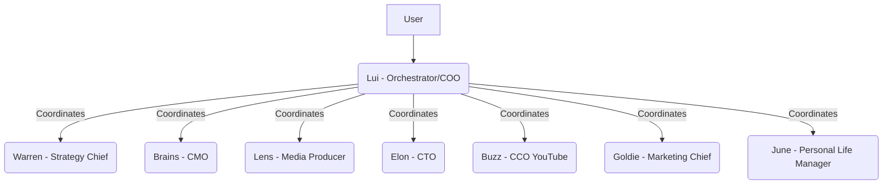

**Explanation of Communication:**

*   **User:** Interacts directly with Lui.
*   **Lui (Orchestrator/COO):** Acts as the central hub, receiving requests from the User and delegating tasks to other agents. Lui is responsible for coordinating the activities of all other agents.
*   **Other Agents (Warren, Brains, Lens, Elon, Buzz, Goldie, June):** These are specialized agents that receive instructions and tasks from Lui. They perform their specific functions and presumably report back to Lui with results or updates.

**How They Communicate (Implicit):**

The arrows indicate data flow and control. While not explicitly drawn, communication channels would likely include:

*   **Task Assignment:** Lui sends tasks to individual agents.
*   **Reporting/Updates:** Agents send progress reports, results, or questions back to Lui.
*   **Information Sharing:** Lui might facilitate information sharing between agents if a task requires input from multiple specialists.

This diagram provides a high-level overview of the multi-agent system structure and communication flow, with Lui at the center of coordination.